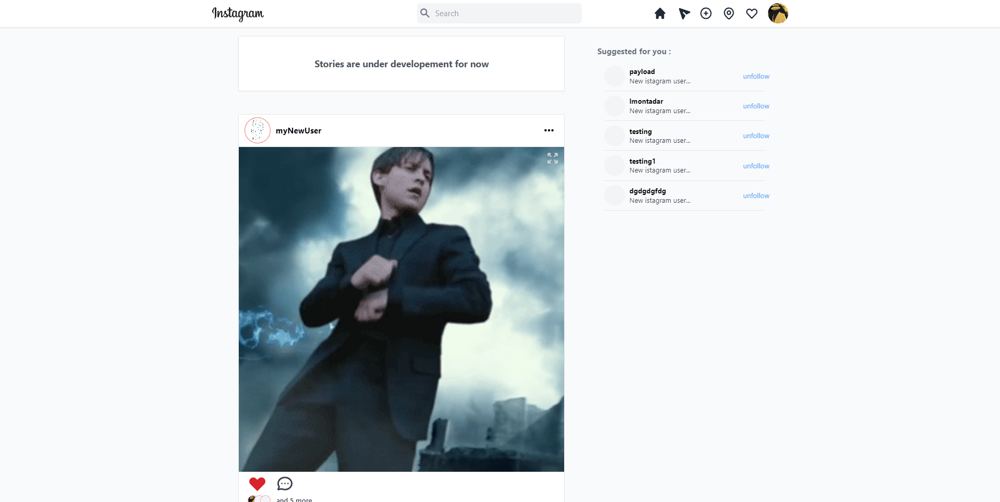

A social media graphQl API, built using fastApi framework

# Features
- get, add, remove and update posts.
- get, add, remove and update users.
- get, add, remove and update comments.
- get, add and remove likes.
- get, add and remove follows.
- ...


|            | Add     | Update  | Remove  | get one  | get all |
|------------|---------|---------|---------|----------|---------| 
| posts      | &check; | &check; | &check; |  &check; | &check; |
| users      | &check; | &check; | &check; |  &check; | &check; |
| comments   | &check; | &check; | &check; |  &check; | &check; |


|            | toggle | get one | get all |
|------------|--------|---------|---------|
| likes      |&check; | &check; | &check; |
| follows    |&check; | &check; | &check; |


## What you can do with it:
Here is an instagram clone i made using this api and reactjs
https://instagram3.netlify.app



# Installation

Installing the dependencies

```sh
$ pip install -r requirements.txt
```


make a .env file with the following information or create the then directly 
in environment variables 
```
my_URL = your postgress database url
secret_key = secret key for the hash function
expire_time = jwt_expire time by minutes
algorithm = HS256
```

run the server
```sh
$ alembic upgrade head && uvicorn app.main:app --host=0.0.0.0 --port=3000
```


# Queries and mutations 
note: you better look at the generated docs by graphql in the playground
if you want the full details about every query and mutation 

## User
### fields:
- id
- username
- email
- bio
- avatar_url
- created_at
- posts
- posts_count
- followers
- following
- followers_count
- following_count 
- is_followed
### queries: 
- me()
- all_users(limit, offset)
- one_user(id)
- search_users(query)
### mutations:
- create_user(username, email, password)
- delete_user(id)
- update_user(id, avatar_url, username, email, bio)
- login(username, password)


## Post
### fields:
- id
- content
- attachement
- created_at
- updated_at
- author
- comments
- likes
- comments_count
- likes_count
- is_liked
### queries: 
- all_posts(limit, offset)
- one_post(id)
### mutations:
- create_post(content, attachement)
- delete_post(id)
- update_post(id, content, attachement)


## Comment
### fields:
- id
- content
- created_at
- updated_at
- author
- post
### queries: 
- all_comments(limit, offset)
- one_comment(id)
- comment_by_post(post_id)
### mutations:
- create_comment(post_id, content)
- delete_comment(id)
- update_comment(id, content)


## Like
### fields:
- user_id
- post_id
- author_id

### queries: 
- all_likes(limit, offset)
- like_by_post(post_id)
- like_by_user(user_id)

###mutations:
- toggle_like(post_id)


## Follow
### fields:
- follower_id
- followed_id
- follower
- followed
### queries: 
- all_follows(limit, offset)
### mutations:
- toggle_follow(user_id)


# Database Tables

| users table |           
|-------------|           
| id          |           
| username    |           
| email       |           
| password    |           
| bio         |           
| avatar_url  |           
| created_at  |           
| posts       |           
| followers   |           
| following   |                           


| posts table |
|-------------|
| id          |
| content     |     
| attachement |     
| author_id   |     
| author      |     
| comments    |     
| likes       |
| created_at  |
| updated_at  |


| comments table |
|----------------|
| id             |
| content        |
| author_id      |
| author         |
| post_id        |
| post           |
| created_at     |
| updated_at     |


| comments table |
|----------------|
| post_id        |
| user_id        |
| author         |


| follows table  |
|----------------|
| follower_id    |
| followed_id    |
| follower       |
| followed       |
